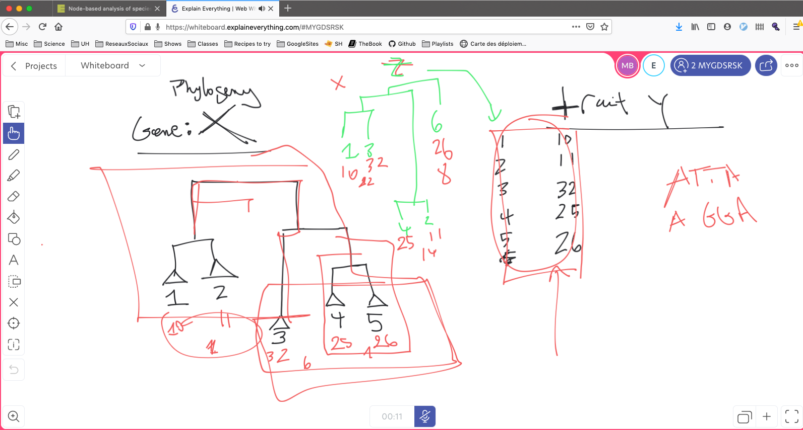

# Note for 3rd project

## Objectives

Given a trait and a set of organisms:
- Find a complementary set of genes that best explain the trait's variations
- Build a "patchwork" tree based on those genes (similar idea as Ghost-tree)

## Hypotheses

- The variability of a trait is correlated to the evolution of a set
  of genes

## Sub-problems

- How to evaluate the correlation between a tree and a trait

	- [Pagel's lambda](https://www.nature.com/articles/44766)
	- [Bloomberg's K](https://pubmed.ncbi.nlm.nih.gov/12778543/)

- How to construct a tree based on multiple genes?

	- Concatenate the genes
	- [Consensus trees](https://academic.oup.com/sysbio/article/58/1/35/1674751)
	- [Ghost-tree](https://link.springer.com/article/10.1186/s40168-016-0153-6)
	- Other approaches such as done in [BEAST](https://bmcecolevol.biomedcentral.com/articles/10.1186/1471-2148-7-214) with a Bayesian approach      
	  
## Applications

- Identify trait/genes correlations -> discovery of unknown gene function
- Trait imputation
	
## Miscellaneous remarks

- We are not limited to genes/proteins, but rather any trait that can
  be used to construct a phylogenetic tree (e.g. gene content)

## Databases

### DB of orthologs

List of available databases:
https://questfororthologs.org/orthology_databases

Biggest ones:
- [OrthoDB](https://www.orthodb.org/?page=filelist) (>4k prokaryotes, 588 eukaryotes, >3k viruses)
- eggNOG (1793 prokaryotes, 238 eukaryotes, 352 viruses)
- metaPhOrs (2714 organisms)
- OMA (>2k organisms)
- OrtholugeDB (>2k organisms)

#### Available orthoDB tables (from project's README)

OG = Orthologous Group 

| Filename                  | Description                                                                                      |
|---------------------------|--------------------------------------------------------------------------------------------------|
| odb10v1_levels.tab        | NCBI taxonomy nodes where Ortho DB orthologous groups (OGs) are calculated                       |
| odb10v1_species.tab       | Ortho DB individual organism (aka species) ids based on NCBI taxonomy ids (mostly species level) |
| odb10v1_level2species.tab | Correspondence between level ids and species ids                                                 |
| odb10v1_genes.tab         | Ortho DB genes with some info                                                                    |
| odb10v1_gene_xrefs.tab    | UniProt, ENSEMBL, NCBI, GO and InterPro ids associated with Ortho DB gene                        |
| odb10v1_OGs.tab           | Ortho DB orthologous groups                                                                      |
| odb10v1_OG2genes.tab      | OGs to genes correspondence                                                                      |
| odb10v1_OG_xrefs.tab      | OG associations with GO, COG and InterPro ids                                                    |
| v9_v10_OGs_map.tab        | mappings between the previous and current release orthologous group ids                          |
| odb10v1_all_fasta.tab     | AA sequence of the longest isoform for all genes, fasta formatted                                |
| odb10v1_all_og_fasta.tab  | AA sequence of the longest soform for all genes participating in OG, fasta formatted             |

### Trait database

From [J. Madin et
al.](https://www.nature.com/articles/s41597-020-0497-4#Sec7)

condensed_traits_NCBI.csv: taxID (subspecies) | taxID (species) | Lineage | Traits

## Example data

Table 1 from [Fierer et al.](https://www.frontiersin.org/articles/10.3389/fmicb.2014.00614/full)

## Figures

