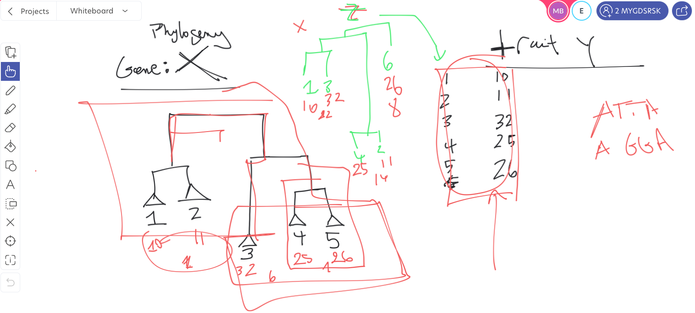

# notes-project-3

## Objectives

Find an ordered set of genes to recursively build a phylogenetic tree
that optimizes the phylogenetic signal related to a trait.

## Hypotheses
- The variability of a trait is correlated to the evolution of a set
  of genes

## Sub-problems

- How to evaluate the correlation between a tree and a trait

	- [Pagel's lambda](https://www.nature.com/articles/44766)
	- [Bloomberg's K](https://pubmed.ncbi.nlm.nih.gov/12778543/)

- How to construct a tree based on multiple genes?

	- Concatenate the genes
	- [Ghost-tree](https://link.springer.com/article/10.1186/s40168-016-0153-6)
	

## Databases

List of available databases:
https://questfororthologs.org/orthology_databases

Biggest ones:
- OrthoDB (>4k prokaryotes, 588 eukaryotes, >3k viruses)
- eggNOG (1793 prokaryotes, 238 eukaryotes, 352 viruses)
- metaPhOrs (2714 organisms)
- OMA (>2k organisms)
- OrtholugeDB (>2k organisms)

### OrthoDB 

Databases available here: https://www.orthodb.org/?page=filelist

OG = Orthologous Group 

| _species.tab  |                      |              |            |                                                |                                        |      |              |
| :-----------: | :------------------: | :----------: | :--------: | :--------------------------------------------: | :------------------------------------: | ---- | :----------: |
| taxID  (NCBI) | OrganismID (orthoDB) | species name | assemblyID | total count of clustered genes in this species | total count of the OGs it participates |      | mapping type |

| _genes.tab       |                       |           |          |           |             |                  |             |
| :--------------- | :-------------------: | :-------: | -------- | --------- | ----------- | ---------------- | ----------- |
| GeneID (orthoDB) | OrganismID  (orthoDB) | ProteinID | Synonyms | UniprotID | Ensembl IDs | gid or gene name | description |

| _OGs.tab |                                                   |                                     |
| -------- | :-----------------------------------------------: | :---------------------------------: |
| OG uID   | taxID of level based on which the group was built | OG name (most common gene in group) |

| _OG2genes.tab |                 |
| :------------ | --------------- |
| OG uID        | GeneID(OrthoDB) |

### Trait database

From [J. Madin et
al.](https://www.nature.com/articles/s41597-020-0497-4#Sec7)

| condensed_traits_NCBI.csv |                 |         |        |
| :------------------------ | :-------------- | :------ | ------ |
| taxID (subspecies)        | taxID (species) | Lineage | Traits |

## Figures

