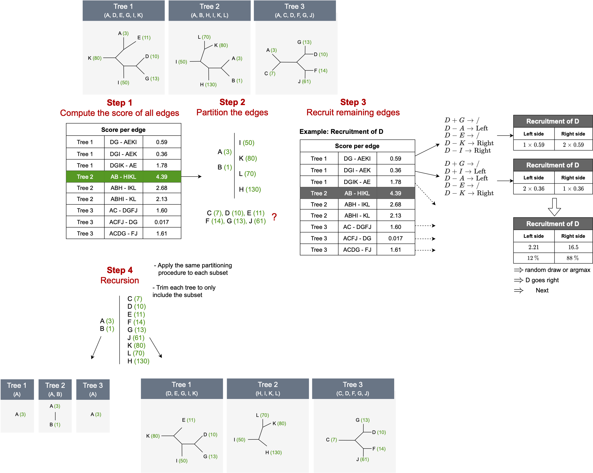

# Supervised tree merging (in development)

Given a set of trees classifying different sets of species, we want to build a consensus tree for the union of all the species in order to maximize the correlation between the consensus and a trait.

The procedure works in 2 steps:
    - Partioning step: the species are separated along the best performing edge. Species that are not in the tree whose edge is selected are set aside
    - Recruitment step: The species that were not selected are iteratively recruited to one of the 2 partitions based on the information from the other edges. Given a partition $P = (P_1, P_2)$, for each edge and each species S, do:
        - if #pairs with S in favor of P1 > #pairs with S in favor of P2 $\rightarrow$ add edge score to P1 weight, else to P2
        - add S to the partition that has the biggest cumulative score (or alternatively, random draw with probability according to the weight)
    
These 2 steps are recursively applied to each partition until no further progress can be achieved.

## Example



## Current issues

- Is the edge selection mecanism biased towards small trees or edges towards the tips?
- Some species appear rarely across the trees (low "prevalence"). The consensus tree needs to account for the uncertainty since there might not be much of a consensus in the end.
- The tree distances are not taken in to account. As such, the algorithm cannot use information from rooted trees with 3 species
- Can we use the final consensus tree for something? Otherwise, this method is maybe not that different fron phylogenetic signal methods such as Pagel's lambda. Also, if we do not use it, then we should just build a tree based on the trait value itself and not bother creating a consensus.
- The final tree contains polytomies. Should be try to resolve them or keep them?

## Implementation

```python
def make_binary_partition(species, trees):
  	"""
  	1) Prune <trees> with leaves in <species>
  	2) Find edge with best score --> binary partition of species in edge
  	3) Add the remaning species to the partition using a vote among the trees
  	4) Recurse on each set in the partition
  	"""
    # prune tree to only keep relevant species
	trees = [subset(t, species) for t in trees]
	# select partition (=best edge)
    edge_scores = score_edges(trees)
	(v1, v2) = edge_scores.argmax()
    
	# recruit missing species in v1 or v2 using 
    # with a weighted vote among the remaining edges
	recruits = {x: [0, 0] for x in species if x not in set.union(v1, v2)}
        
    for edge, score in edge_scores:
        for spec in recruits:
        # use evidence in edge to recruit spec to either v1 or v2
            vote = recruit_node(edge, spec, (v1, v2))
            recruits[spec][vote] += score
             
    for spec, scores in recruits.items():
        choice = random.choices([0, 1], weight=scores/scores.sum())
        if choice == 0:
            v1.add(spec)
        else:
            v2.add(spec)
                          
    partition = [make_binary_partition(v1, trees), make_binary_partition(v2, trees)]
                                       
    return partition
```
